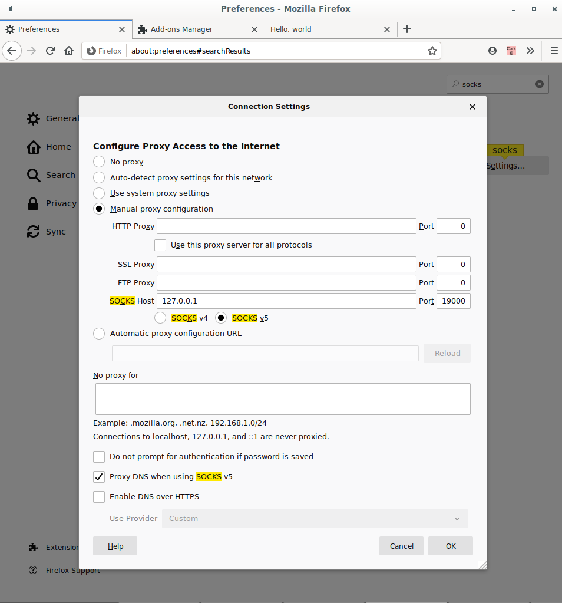

# Content Delivery Network (CDN)

#### Machines
    * North America (DNS):  52.177.9.49
    * Europe (chache 1):    40.127.181.75
    * Asia (chache 2):      13.67.71.115

All machines running Ubuntu Server 18.04 LTS 

### North America

##### System configurations
* `sudo apt update && sudo apt upgrade -y`
* `sudo apt install bind9 bind9utils -y`
* `sudo ufw allow Bind9`
* `sudo ufw allow 22`
* `sudo ufw allow 80`
* `sudo ufw enable`
   
##### DNS configuration files
* <i>Named</i>
    * Edit:
        * [/etc/bind/named.conf](backup/named.conf)
        * [/etc/bind/named.conf.local](backup/named.conf.local)
        * [/etc/bind/named.conf.options](backup/named.conf.options)
        
    * Check with:
        * `named-checkconf /etc/bind/named.conf.local`

    
* <i>Zones</i>
    * Set  zone configuration files:     
        * [/var/cache/bind/master/demo-tar.com/europe/zone.conf](backup/europe-zone.conf)
        * [/var/cache/bind/master/demo-tar.com/north-america/zone.conf](backup/north-america-zone.conf)
        * [/var/cache/bind/master/demo-tar.com/asia/zone.conf](backup/asia-zone.conf)
        
    * Check with:
        * `named-checkzone demo-tar.com {FILE PATH}`
        
* Restart service: `sudo systemctl restart bind9 && sleep 2 && sudo systemctl status bind9`

##### HTTP server
* Run HTTP server: `cd /home/tar/server/ && python3 -m http.server --bind 0.0.0.0 80`

##### Crontab
* At root crontab add `@reboot ( cd /home/tar/server/ && python3 -m http.server --bind 0.0.0.0 80 & )` for running at startup

 

### Europe & Asia
##### System configurations
* `sudo apt update && sudo apt upgrade -y`
* `sudo ufw allow 80`
* `sudo ufw allow 22`
* `sudo ufw enable`

##### Cache server
* Install [requirements](Cache%20Server/requirements.txt): `pip3 install -U -r requirements.txt`
* Run [cache server](Cache%20Server/server.py): `python3 cache/server.py`

##### Crontab
* At root crontab add `@reboot ( python3 /home/tar/cache/server.py & )` for running at startup

 

#### Socks configuration
* Add DNS machine IP to local interface list of DNS servers (in this case the North American machine)
* Uncomment and edit the following settings in [/etc/ssh/sshd_config](backup/sshd_config) at remote machine:
    * AllowTcpForwarding yes
    * TCPKeepAlive yes
    * PermitTunnel yes   
* Restart ssh: `sudo systemctl restart sshd`

* Example of tunnel:
    * Tunnel to <i>North-America</i> machine: `ssh 52.177.9.49 -l tar -D 19000 -4fN`
    * Firefox configuration:
        * Go to <about:preferences#general> and scroll down to <b>Network Settings</b>
        * Set the configuration like the following image:
          

            
          

        * Open www.demo-tar.com

To mask a request by making it look like it's from another country, it must add `nameserver {DNS machine IP}` to [/etc/resolv.conf](backup/resolv.conf) in the foreign machines.
For instance, if the requester is in Europe, the configuration must be added to North America and Asia machines to make requests look like came from the clients served by those machines.        
 

#### Extra
* Set DNS servers
    * Example for US machine:
        * Keep a copy of the [file](backup/set%20servers.yaml) in the home directory
        * Run `sudo cp 50-cloud-init.yaml  /etc/netplan/50-cloud-init.yaml && sudo netplan apply`
* Check DNS resolution: `dig @52.177.9.49 www.demo-tar.com`
* DNS IP database: <https://geoip.site/download/IP2Location/GeoIP.acl>